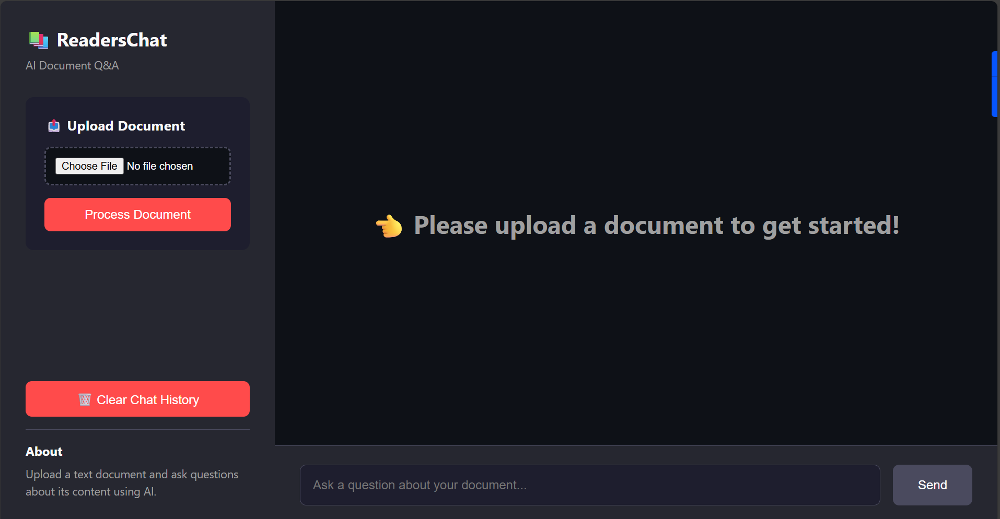

ReadersChat is an intelligent chatbot application that allows you to upload text documents and ask questions about their content using AI. Built with **FastAPI** and **LangChain**, it uses OpenAI's GPT models and RAG (Retrieval-Augmented Generation) to provide accurate, context-aware answers.




- **FastAPI Backend**: High-performance Python API
- **Document Upload**: Upload any `.txt` file to analyze
-  **Smart Q&A**: Get accurate answers based on document content
- **Conversation Memory**: Remembers last 3 exchanges for contextual follow-up
- **Source Citations**: View relevant document excerpts supporting each answer
-  **Modern UI**: Clean, responsive interface with dark theme
-  **Fast**: Optimized with FAISS vector store

## Architecture

```
ReadersChat/
├── server/           # FastAPI backend
│   ├── main.py      # API endpoints and RAG logic
│   ├── requirements.txt
│   └── .env         # API keys (not committed)
├── client/          # Frontend
│   ├── index.html   # Main UI
│   ├── styles.css   # Styling
│   └── script.js    # Client logic
└── app.py           # Legacy Streamlit version
```

##  Prerequisites

- Python 3.12 or higher
- OpenAI API key

##  Installation

1. **Clone the repository**
   ```bash
   git clone https://github.com/OpokuFrimpong/ReadersChat.git
   cd ReadersChat
   ```

2. **Install server dependencies**
   ```bash
   cd server
   pip install -r requirements.txt
   ```

3. **Set up environment variables**
   
   Create a `.env` file in the `server/` directory:
   ```bash
   cd server
   cp .env.example .env
   ```
   
   Edit `server/.env` and add your OpenAI API key:
   ```
   OPENAI_API_KEY=your-openai-api-key-here
   PORT=8000
   ```
   
   **Important**: Never commit your `.env` file to GitHub!

##  Running the Application

### Start the FastAPI server:

```bash
cd server
python main.py
```

Or using uvicorn:
```bash
cd server
uvicorn main:app --reload --port 8000
```

The app will be available at:
- **Application**: http://localhost:8000
- **API Docs**: http://localhost:8000/docs
- **Alternative Docs**: http://localhost:8000/redoc

### Alternative: Streamlit Version

You can also run the legacy Streamlit version:
```bash
streamlit run app.py
```

##  Usage

1. **Upload a Document**
   - Click "Choose File" in the sidebar
   - Select a `.txt` file from your computer
   - Click "Process Document"

2. **Ask Questions**
   - Type your question in the chat input at the bottom
   - Press Enter or click "Send"
   - The AI will analyze the document and provide an answer
   - View source excerpts below each answer

3. **Follow-up Questions**
   - The chatbot remembers your last 3 exchanges
   - You can ask follow-up questions using context

4. **Clear History**
   - Click " Clear Chat History" to reset the conversation

## 📡 API Endpoints

### `POST /upload`
Upload and process a document
- **Body**: `multipart/form-data` with `.txt` file
- **Response**: `{"message": "...", "chunks": 42, "filename": "..."}`

### `POST /chat`
Ask a question
- **Body**: `{"question": "your question here"}`
- **Response**: `{"answer": "...", "sources": [...]}`

### `GET /history`
Get conversation history
- **Response**: `{"history": [...]}`

### `DELETE /history`
Clear conversation history
- **Response**: `{"message": "History cleared"}`

### `GET /health`
Health check
- **Response**: `{"status": "healthy", ...}`

## Tech Stack

### Backend
- **FastAPI** - Modern Python web framework
- **LangChain** - AI/LLM orchestration
- **OpenAI GPT-4o** - Language model
- **FAISS** - Vector similarity search
- **Python 3.12** - Programming language

### Frontend
- **HTML5/CSS3** - Structure and styling
- **Vanilla JavaScript** - Client-side logic
- **Responsive Design** - Works on all devices

### Additional Tools
- **RecursiveCharacterTextSplitter** - Document chunking
- **OpenAIEmbeddings** - Text vectorization
- **Uvicorn** - ASGI server

##  Project Structure

```
ReadersChat/
├── server/                    # FastAPI Backend
│   ├── main.py               # API endpoints & RAG logic
│   ├── requirements.txt      # Python dependencies
│   ├── .env                  # Environment variables (not tracked)
│   ├── .env.example          # Example env file
│   ├── .gitignore           # Git ignore
│   └── uploads/             # Uploaded files (not tracked)
├── client/                   # Frontend
│   ├── index.html           # Main UI
│   ├── styles.css           # Styling
│   └── script.js            # Client logic
├── app.py                    # Legacy Streamlit version
├── requirements.txt          # Streamlit dependencies
├── .env                      # Root env file
├── .gitignore               # Root git ignore
├── README.md                # Documentation
├── alice_in_wonderland.txt  # Sample document
└── knowledge_base.txt       # Sample knowledge base
```

## Security Best Practices

- ✅ API keys stored in `.env` files (excluded from Git)
- ✅ Never hardcode sensitive credentials in code
- ✅ `.gitignore` prevents accidental exposure of secrets
- ✅ File upload validation
- ✅ CORS configuration for API security
- ✅ Environment variable validation

## Contributing

Contributions are welcome! Please feel free to submit a Pull Request.

1. Fork the repository
2. Create your feature branch (`git checkout -b feature/AmazingFeature`)
3. Commit your changes (`git commit -m 'Add some AmazingFeature'`)
4. Push to the branch (`git push origin feature/AmazingFeature`)
5. Open a Pull Request

## License

This project is open source and available under the MIT License.

##  Author

**Opoku Frimpong**
- GitHub: [@OpokuFrimpong](https://github.com/OpokuFrimpong)
- Repository: [ReadersChat](https://github.com/OpokuFrimpong/ReadersChat)

## Acknowledgments

- **OpenAI** for providing the GPT models and API
- **LangChain** team for the excellent AI framework
- **FastAPI** for the high-performance web framework
- **FAISS** by Facebook Research for vector search

---

 If you find this project useful, please consider giving it a star!
